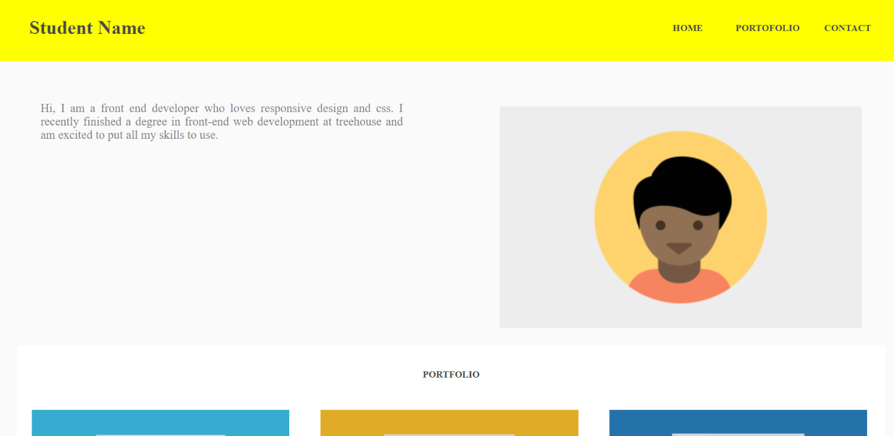

<h1>Project 2 in Techdegree. Treehouse Responsive Layout</h1>
 

By using HTML, CSS, and responsive design, I developed a mobile-first web page with a layout that adjusts to fit mobile phones, tablets, and desktop displays.

 
<h2>Live Demo</h2>

 
<h3>Overview</h3>

In this project, I built a responsive page by using a mobile-first approach. By focusing first on the mobile version and then added breakpoints using media queries for the larger screen sizes. The layout accommodates small, medium, and large screen sizes. I was tasked to build the website with all the HTML and CSS myself by using the provided mockups as a guide.
 
 
<h3>Skills</h3>
<ul>
  <li>HTML</li>
  <li>CSS</li>
  <li>Media Queries</li>
  <li>Responsive Images</li>
  <li>Testing and debugging</li>
</ul>
<h3>Conclusion</h3>

Finally, I learned how to write all of the HTML and CSS by myself. Since using a mobile-first approach, I learned that media queries has important role in creating responsive website, that has a fitness on the tablet and desktop versions. I also learn thatt it is very important that responsive images work. While adding my own HTML and CSS, some issues came up, and I used the Dev Tools to debug and test the code I added
.

